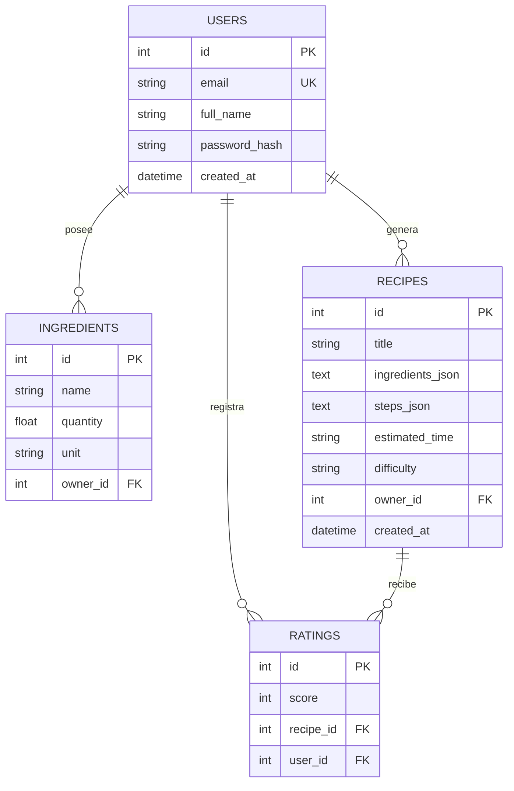

# Diagrama entidad-relación

```mermaid
erDiagram
    USERS ||--o{ INGREDIENTS : posee
    USERS ||--o{ RECIPES : genera
    USERS ||--o{ RATINGS : registra
    RECIPES ||--o{ RATINGS : recibe
    USERS {
      int id PK
      string email UK
      string full_name
      string password_hash
      datetime created_at
    }
    INGREDIENTS {
      int id PK
      string name
      float quantity
      string unit
      int owner_id FK
    }
    RECIPES {
      int id PK
      string title
      text ingredients_json
      text steps_json
      string estimated_time
      string difficulty
      int owner_id FK
      datetime created_at
    }
    RATINGS {
      int id PK
      int score
      int recipe_id FK
      int user_id FK
    }
```
